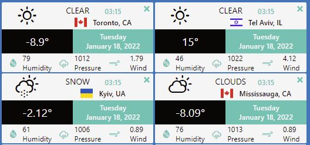

import "./assets/WeatherApp.jpg";

### Weather Web Application

#### Fully functional weather app with React and Typescript. Functionality includes the ability to show weather cards for different cities, add and remove city cards, drag and drop sorting the cards.



G:\Ed\2021.7_30_ReactDevelopmentProjects\51-my-proj1\proj1\src\assets\WeatherApp.jpg

### Key Words:

### React:

useState, useEffect, useReduce, useContext, useRef

### Custom Hooks:

useFocus, useAppState, useGetWeather, useImmerReducer, useItemDrag, useDrop

### Typescript:

fetch, async, await, try, catch, destructuring, spread operator, rest operator, slice, date.toLocaleDateString

### API:

Open Weather Api

### Icons:

Weather icons, React icons, react-flag-icon-css

### Styled-components :

react component, props

### CSS:

flex, css grid, fluent typography, clamp, rem, vw, vh

### npm:

use-immer, react-dnd, react-dnd-html5-backend,react-flag-icon-css, nanoid

### Installation from zero:

```js
npx create-react-app project1
cd project1
yarn add use-immer
yarn add nanoid
yarn add react-dnd@14.0.1 react-dnd-html5-backend@14.0.0
yarn add react-icons
yarn add react-flag-icon-css
yarn start
```

### Links:

https://styled-components.com/
https://react-icons.github.io/react-icons/
https://github.com/erikflowers/weather-icons
https://openweathermap.org/api
https://www.npmjs.com/package/use-immer
https://react-dnd.github.io/react-dnd/about

### Immer

useImmer(initialState) is very similar to useState. When passing a function to the updater, the draft argument can be mutated freely, until the producer ends and the changes will be made immutable and become the next state.

### React DnD

React DnD is a set of React utilities to help you build complex drag and drop interfaces while keeping your components decoupled.

## Create React App boilerplate with LESS compiler setup

## and Ant Design React UI library.

#### Task: <span style="color:blue"> Setup Less with create-react-app boilerplate, add Ant Design React UI library, get default variables from ant-design default.less file.</span>

There is not such an easy solution to handle compiling **_Less_** stylesheets. This is problematic because to manually configure webpack to compile **_Less_** stylesheets requires us to eject from the default **_create-react-app_** configuration. So, set it up with react app, without having to eject from **_create-react-app_** and modifying webpack config manually. We also add **_antd_** (Ant Design React UI library) to project. The antd use **_Less_** **_language_** extension for CSS, so we show, also, how to get default variables from antd less files.

You can find more details here:

https://dev.to/joefstack/how-to-setup-less-with-react-without-ejecting-1nej

https://github.com/ant-design/ant-design/blob/master/components/style/themes/default.less  
https://github.com/voldo5/cra-less-starter

```js
npx create-react-app cra-less-starter
npm install less less-watch-compiler concurrently --save-dev
```

add file **less-watcher.config.json**

```js
{
"watchFolder": "src/",
"outputFolder": "src/",
"sourceMap": true,
"runOnce": false,
"enableJs": true
}
```

```js
npm install concurrently --save-dev
```

add to **package.json**

```js
"scripts": {
"start": "concurrently --kill-others \"less-watch-compiler --config less-watcher.config.json\" \"react-scripts start\"",
…
},
```

```js
npm i -S craco-antd antd
npm install
npm start
```

add link to less default variables in **App.less** file

```js
@import "antd/lib/style/themes/default.less";
```

and add two variables

```js
@app-primary: #0f3460;
@app-secondary: #d9322c;
```

and, for example, use antd default variable **@height-lg** in **custom-btn** class

```js
.custom-btn {
  background: @app-secondary;
  height: @height-lg + 6;
}
```

# Getting Started with Create React App

This project was bootstrapped with [Create React App](https://github.com/facebook/create-react-app).

## Available Scripts

In the project directory, you can run:

### `npm start`

Runs the app in the development mode.\
Open [http://localhost:3000](http://localhost:3000) to view it in the browser.

The page will reload if you make edits.\
You will also see any lint errors in the console.

### `npm test`

Launches the test runner in the interactive watch mode.\
See the section about [running tests](https://facebook.github.io/create-react-app/docs/running-tests) for more information.

### `npm run build`

Builds the app for production to the `build` folder.\
It correctly bundles React in production mode and optimizes the build for the best performance.

The build is minified and the filenames include the hashes.\
Your app is ready to be deployed!

See the section about [deployment](https://facebook.github.io/create-react-app/docs/deployment) for more information.

### `npm run eject`

**Note: this is a one-way operation. Once you `eject`, you can’t go back!**

If you aren’t satisfied with the build tool and configuration choices, you can `eject` at any time. This command will remove the single build dependency from your project.

Instead, it will copy all the configuration files and the transitive dependencies (webpack, Babel, ESLint, etc) right into your project so you have full control over them. All of the commands except `eject` will still work, but they will point to the copied scripts so you can tweak them. At this point you’re on your own.

You don’t have to ever use `eject`. The curated feature set is suitable for small and middle deployments, and you shouldn’t feel obligated to use this feature. However we understand that this tool wouldn’t be useful if you couldn’t customize it when you are ready for it.

## Learn More

You can learn more in the [Create React App documentation](https://facebook.github.io/create-react-app/docs/getting-started).

To learn React, check out the [React documentation](https://reactjs.org/).
